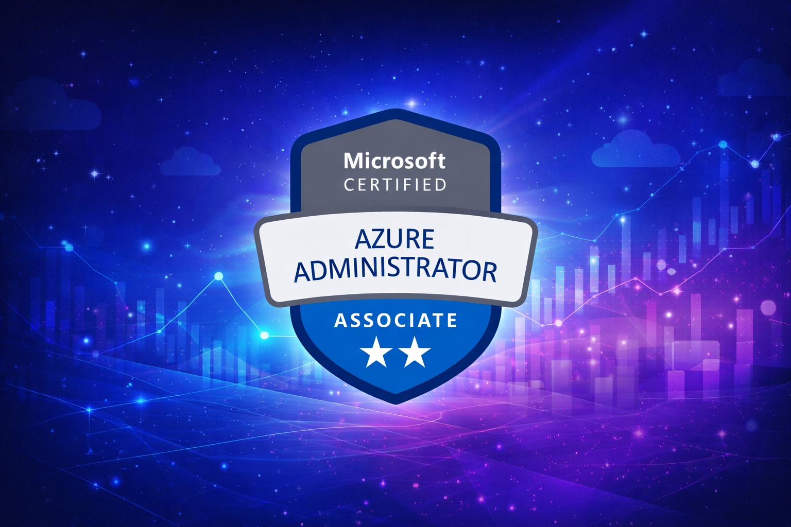
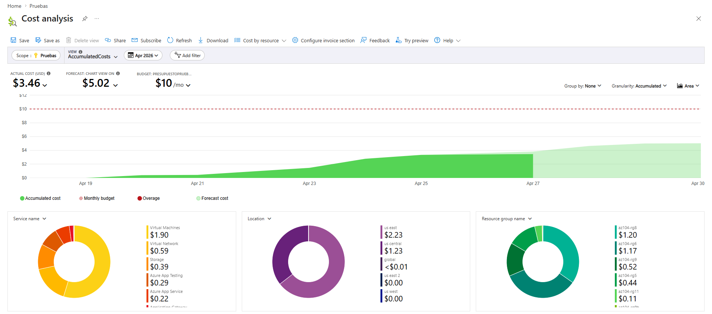
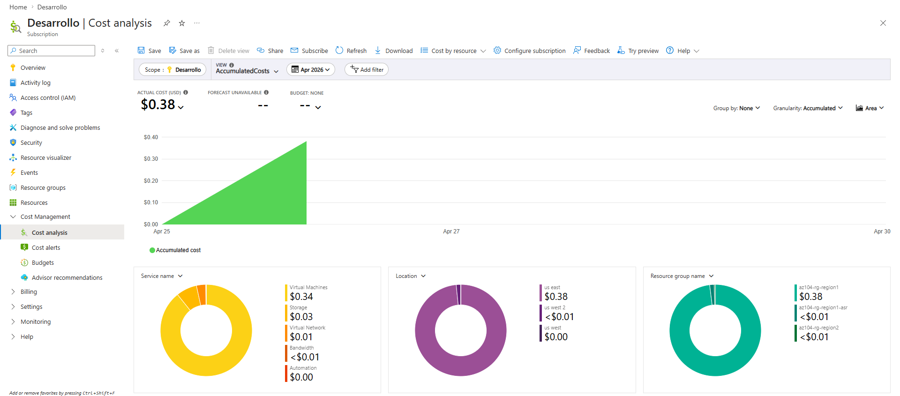

# AZ-104: Microsoft Azure Administrator Associate

# Indice

- [Descripción](#descripción)
- [Objetivos de aprendizaje](#objetivos-de-aprendizaje)
- [Requisitos previos](#requisitos-previos)
- [Buenas prácticas](#buenas-prácticas)
- [Costo total de los labs en Azure](#costo-total-de-los-labs-en-azure)
- [Enlaces de laboratorios](#enlaces-de-laboratorios)
- [Contribuciones](#contribuciones)
- [Licencia](#licencia)

---

## Descripción

Este repositorio reúne una recopilación de los [**laboratorios del curso AZ-104: Microsoft Azure Administrator**](https://microsoftlearning.github.io/AZ-104-MicrosoftAzureAdministrator/) traducidos al español, desde el **Lab 01 hasta el Lab 11** (14 en total) cada uno documentado con imágenes por cada tarea.
Cada laboratorio aborda un aspecto clave de la administración de Azure, construyendo paso a paso las competencias necesarias para gestionar identidades, recursos, redes, almacenamiento, máquinas virtuales, aplicaciones PaaS, protección de datos y monitoreo.

**En conjunto**, estos laboratorios ofrecen una visión completa de las responsabilidades de un **Azure Administrator**, desde la gestión de identidades y gobernanza hasta la operación de redes, almacenamiento, máquinas virtuales, aplicaciones PaaS y sistemas de monitoreo.
El resultado es un recorrido integral que refuerza la **seguridad, gobernanza, eficiencia operativa y optimización de costos** en entornos de nube con Microsoft Azure.

---

## Objetivos de aprendizaje

- Administrar identidades y accesos con Microsoft Entra ID.
- Implementar gobernanza y cumplimiento con RBAC y Azure Policy.
- Desplegar y administrar recursos mediante ARM Templates.
- Configurar redes virtuales, conectividad entre sitios y balanceo de tráfico.
- Gestionar almacenamiento, máquinas virtuales y servicios PaaS.
- Proteger datos con Backup y Recovery Services.
- Monitorear infraestructura con Azure Monitor y Log Analytics.

---

## Requisitos previos

- Suscripción activa de *Microsoft Azure* **(Idealmente la versión de prueba con 200 USD de créditos gratuitos)**.
- Permisos de administrador para crear y eliminar recursos.
- AZ-900 y Familiaridad básica con el portal de Azure y PowerShell/CLI.

---

## Buenas prácticas

- Eliminar el **resource group** al finalizar cada lab para evitar costos innecesarios.
- Documentar contraseñas y configuraciones solo para uso personal en entornos de práctica.
- Usar regiones cercanas para reducir latencia y costos de red.

## Costo total de los labs en Azure

El costo total de los 14 laboratorios en 2 de mis suscripciones en las cuales trabaje con los laboratorios fue cercano a los **$ 10 USD**

---

## Enlaces de laboratorios

### **Enlaces de la recopilación de laboratorios traducidos al español:**

- [**Lab 01 – Manage Microsoft Entra ID Identities:**](https://github.com/Slider2019/Lab-01---Gesti-n-de-identidades-de-Microsoft-Entra-ID)
Administración de identidades en **Microsoft Entra ID**, creación de usuarios, grupos y gestión de accesos.

- [**Lab 02a – Manage Subscriptions and RBAC:**](https://github.com/Slider2019/Lab-02a---Administracion-de-suscripciones-y-RBAC) Configuración de **suscripciones y control de acceso basado en roles (RBAC)** para gobernanza y seguridad.

- [**Lab 02b – Manage Governance via Azure Policy:**](https://github.com/Slider2019/Lab-02b-Gestionar-la-Gobernanza-mediante-Azure-Policy) Implementación de **Azure Policy** para aplicar reglas de cumplimiento y automatizar la gobernanza.

- [**Lab 03 – Manage Azure resources by using ARM Templates:**](https://github.com/Slider2019/Lab-03---Administrar-recursos-de-Azure-utilizando-plantillas-de-ARM) Uso de **plantillas ARM y Bicep** para desplegar recursos mediante infraestructura como código.

- [**Lab 04 – Implement Virtual Networking:**](https://github.com/Slider2019/Lab-04---Implementaci-n-de-Redes-Virtuales-en-Azure) Creación de **redes virtuales, subredes y NSGs**, asegurando conectividad y segmentación de tráfico.

- [**Lab 05 – Implement Intersite Connectivity:**](https://github.com/Slider2019/Lab-05-Conectividad-entre-Sitios-en-Azure) Configuración de **VPNs y conexiones entre sitios**, habilitando comunicación segura entre entornos híbridos.

- [**Lab 06 – Implement Network Traffic Management:**](https://github.com/Slider2019/Lab-06-Implementaci-n-de-la-gesti-n-de-tr-fico-de-red) Implementación de **Load Balancers y reglas de tráfico**, garantizando disponibilidad y distribución eficiente.

- [**Lab 07 – Manage Azure Storage:**](https://github.com/Slider2019/Lab-07-Administraci-n-de-Azure-Storage) Administración de **Azure Storage**, cuentas de almacenamiento, blobs, seguridad y acceso compartido.

- [**Lab 08 – Manage Virtual Machines:**](https://github.com/Slider2019/Lab-08---Administraci-n-de-m-quinas-virtuales) Despliegue y gestión de **máquinas virtuales**, configuración de discos, escalabilidad y seguridad de acceso.

- [**Lab 09a – Implement Web Apps:**](https://github.com/Slider2019/Lab-09a-Implementaci-n-de-web-apps) Creación de **App Services** para aplicaciones web, con escalabilidad y monitoreo integrado.

- [**Lab 09b – Implement Azure Container Instances:**](https://github.com/Slider2019/Lab-09b---Implementaci-n-de-Azure-Container-Instances) Ejecución de contenedores en **ACI**, simplificando despliegues rápidos y aislados.

- [**Lab 09c – Implement Azure Container Apps:**](https://github.com/Slider2019/Lab-09c---Implement-Azure-Container-Apps) Implementación de **Azure Container Apps**, habilitando microservicios y aplicaciones modernas basadas en contenedores.

- [**Lab 10 – Implement Data Protection:**](https://github.com/Slider2019/Lab-10-Implement-Data-Protection) Configuración de **Backup y Recovery Services**, asegurando continuidad y recuperación ante fallos.

- [**Lab 11 – Implement Monitoring:**](https://github.com/Slider2019/Lab-11-Implement-Monitoring) Uso de **Azure Monitor y Log Analytics**, creación de alertas, grupos de acción, reglas de procesamiento y consultas KQL para visibilidad avanzada.

---

## Contribuciones

Las contribuciones son bienvenidas.  
Puedes abrir un *issue* o enviar un *pull request* con mejoras.

---

## Licencia

Este repositorio se comparte bajo la licencia MIT.  
Sientete libre de usarlo, adaptarlo y mejorarlo siempre y cuando mencionando la fuente original.
